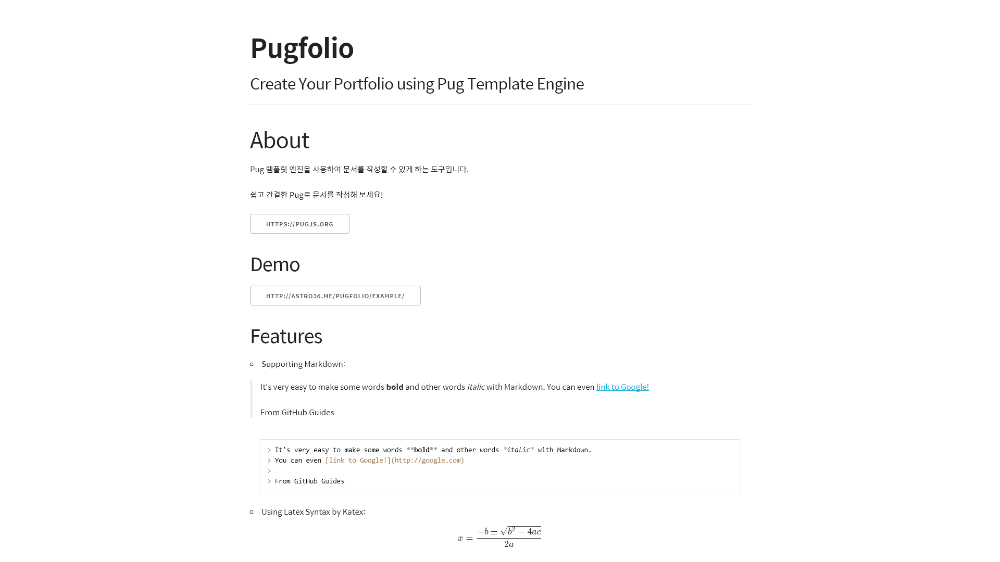

# Pugfolio

> Create Your Portfolio using Pug Template Engine

[](https://circleci.com/gh/Astro36/Pugfolio/) [](https://www.npmjs.com/package/pugfolio) [](https://www.npmjs.com/package/pugfolio)

Pug 템플릿 엔진을 사용하여 문서를 작성할 수 있게 하는 도구입니다.

쉽고 간결한 Pug로 문서를 작성해 보세요!

## ChangeLog

See [CHANGELOG](./CHANGELOG.md)

## Demo



See [example](http://astro36.me/Pugfolio/example/)

## Features

- Supporting Markdown
- Using Latex Syntax by Katex
- Code Highlighting by Prizm
- Save as PDF

## Installation

- Install with npm:

```bash
npm install pugfolio -g
```

- Clone the repo:

```bash
git clone https://github.com/Astro36/Pugfolio.git
```

## Usage

### Command

- To run Pugfolio, use the following format:

``` bash
pugfolio [config=pugfolio.json] [output=index.html]
```

### Configuration

Property    | Type    | Default
----------- | ------- | --------
theme       | String  | required
title       | String  | required
subtitle    | String  | required
author      | String  | required
description | String  | required
writeAsPdf  | Boolean | false
files       | Array   | required

- Here’s an example `pugfolio.json` file:

```json
{
  "theme": "skeleton",
  "title": "Pugfolio",
  "subtitle": "Create Your Portfolio using Pug Template Engine",
  "author": "Astro36",
  "description": "My Portfolio",
  "writeAsPdf": true,
  "files": ["about.pug", "portfolio.pug"]
}
```

You can find available themes on `/themes` directory.

Also, you can add custom theme on `/themes` directory as `*.theme.zip` extension.

## License

```text
Pugfolio
Copyright (C) 2017  Astro

This program is free software: you can redistribute it and/or modify
it under the terms of the GNU General Public License as published by
the Free Software Foundation, either version 3 of the License, or
(at your option) any later version.

This program is distributed in the hope that it will be useful,
but WITHOUT ANY WARRANTY; without even the implied warranty of
MERCHANTABILITY or FITNESS FOR A PARTICULAR PURPOSE.  See the
GNU General Public License for more details.

You should have received a copy of the GNU General Public License
along with this program.  If not, see <http://www.gnu.org/licenses/>.
```

Pugfolio is licensed under the [GPL 3.0](./LICENSE).

[KaTeX](https://khan.github.io/KaTeX/) is licensed under a [MIT License](https://github.com/Khan/KaTeX/blob/master/LICENSE.txt) by Khan Academy.

[Materialize](http://materializecss.com/) is licensed under a [MIT License](https://github.com/Dogfalo/materialize/blob/master/LICENSE) by Dogfalo.

[Prism.js](http://prismjs.com) is licensed under a [MIT License](https://github.com/PrismJS/prism/blob/gh-pages/LICENSE) by Lea Verou.

[Skeleton](http://getskeleton.com) is licensed under a [MIT License](https://github.com/dhg/Skeleton/blob/master/LICENSE.md) by Dave Gamache.

[Font Awesome](http://fontawesome.io/) is licensed under a [SIL OFL 1.1 and MIT License](http://fontawesome.io/license/) by Font Awesome.

[Material Design Icons](https://material.io/icons/) is licensed under an [Apache License 2.0](https://github.com/google/material-design-icons/blob/master/LICENSE) by Google.

[Roboto](https://fonts.google.com/specimen/Roboto) is licensed under an [Apache License 2.0](http://www.apache.org/licenses/LICENSE-2.0) by Christian Robertson.

[Spoqa Han Sans](https://spoqa.github.io/spoqa-han-sans/ko-KR/) is licensed under a [SIL OFL 1.1](https://github.com/spoqa/spoqa-han-sans/blob/master/LICENSE) by Spoqa.
